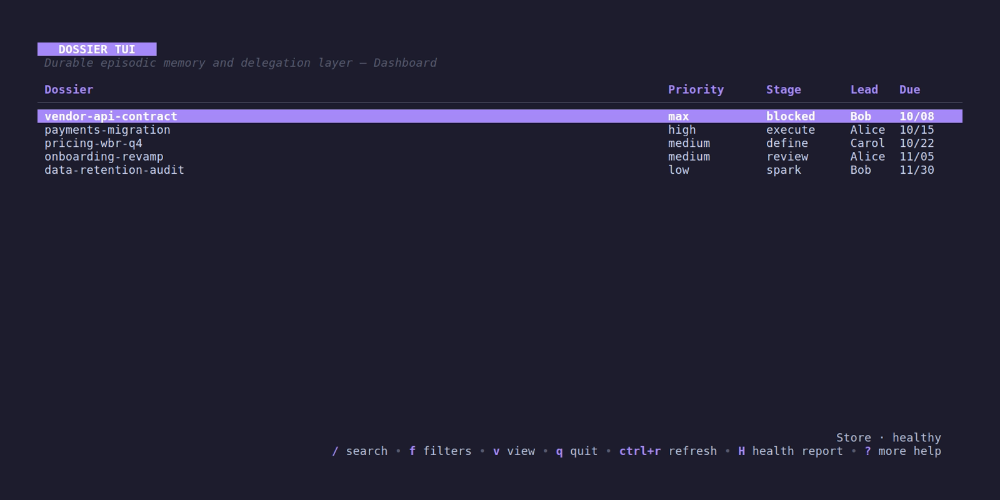
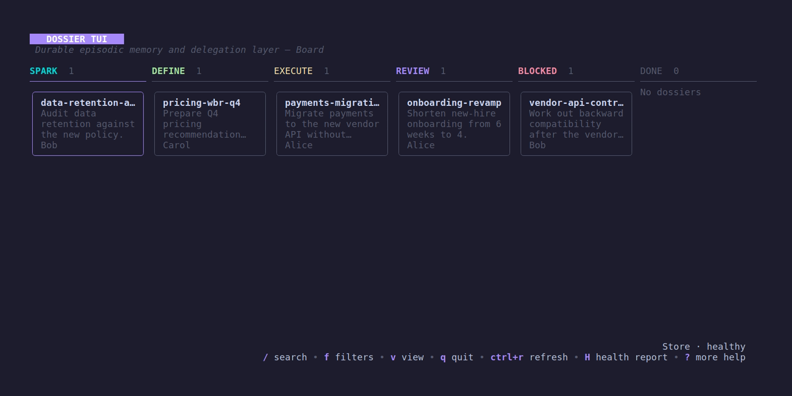

# Dossier

**The work should survive the session.**

AI agents are very good at doing the work in front of them. They're less good at remembering why the work exists, what was decided three sessions ago, who owns the next move, and which source proves what.

Dossier gives long-running Claude Code work a durable, source-cited memory. Promote a session into a **Dossier** and it distills the operational state — objective, decisions, owners, open questions, next action — while keeping the raw evidence one search away.

Next session, you resume the work instead of reconstructing it.

- **Resume with context, not a transcript dump.** Open Dossiers surface at session start, sorted by priority.
- **Keep the receipts.** Claims cite their sources and raw session material is archived automatically.
- **Work across sessions and people.** Optional Team Sync gives a team one shared operational memory without hiding conflicts.
- **Own the state.** Plain Markdown in `~/.dossier/` — no database, no cloud service, no account.

## Install

Requires Claude Code on macOS, Linux, or Windows (Windows is experimental).

**macOS / Linux**

```bash
brew tap execsumo/tap
brew install dossier
dossier init
```

No Homebrew? Grab a binary from the [Releases page](https://github.com/execsumo/dossier/releases), make it executable, and run `./dossier init`.

**Windows (PowerShell)**

```powershell
# use dossier-windows-arm64.exe on ARM machines
curl.exe -L https://github.com/execsumo/dossier/releases/latest/download/dossier-windows-amd64.exe -o dossier.exe
.\dossier.exe init
```

`init` copies Dossier to `%USERPROFILE%\.local\bin`. If `dossier` isn't found afterward, add that folder to your `PATH` and open a new terminal.

`init` sets everything up: your workspace at `~/.dossier`, plus Dossier's MCP server and session hooks in Claude Code. It asks before changing anything, backs up every file it touches, and never overwrites your existing setup. Re-run it anytime; check on things with `dossier doctor`.

Update with `brew upgrade dossier`, or on Windows download the new `.exe` and run `.\dossier.exe init` again. After an update that adds hooks or skills (as v0.5.1 does), run `dossier harness install claude-code` so Claude Code picks them up; it only adds what is missing.

## Use it

### In Claude Code

Once installed, it just works:

- **Session start:** your open Dossiers appear in the conversation. Pick one up or start a new one.
- **During the session:** the agent recalls, saves, searches, and switches Dossiers for you. Each session follows its own Dossier, so parallel sessions never collide.
- **Saving:** type `/save-dossier` before you `/clear` or exit. It brings the Dossier's Distilled State up to date with this session's work, like saving a file. The end-of-session hooks only archive the transcript; they cannot write the summary for you.
- **Save checkpoint:** after a few turns of work with no save, Dossier asks the agent once, at the end of its reply, to save before handing back to you. Set `save_nudge_turns` in `config.yaml` to change how many turns (default 10), or `0` to turn it off.
- **Session end:** the transcript is archived into the Dossier automatically. If a session ended without saving, the next one says so; it does not try to rebuild the work from the transcript.

Capture a new idea in one line:

```text
/spark The vendor changed the API contract and I need to work out migration,
backward compatibility, and who needs to review it.
```

Dossier names it, checks for duplicates, and creates it at medium priority.

### In the terminal UI

Run `dossier` with no arguments for a full-screen dashboard of your Dossiers, sorted by priority.



- **Table or board:** press `v` to switch between a table and stage columns (spark → define → execute → review → blocked → done).
- **Filter** by Lead or discussion interface with `f` — handy for meeting prep.
- **Edit inline:** Lead, stage, priority, due date, next action.
- **Link** sources and **merge** Dossiers, with conflicts shown side by side.
- **Launch an agent** with `c`: a fresh session, already bound to the selected Dossier with its state loaded. Inside [herdr](https://herdr.dev), Dossier becomes a session switcher. Each agent gets its own tab. `c` jumps to a Dossier's running agent (or opens one), `C` always opens another, and `]`/`[` hop between agents. Badges show which agents are working (`●`), need you (`▲`), are done (`✓`) or idle (`○`).
- **Start in the repo:** `dossier repo add <slug> .` links the Dossier to the repo you're in (stored as `github.com/owner/name`, so teammates' checkouts can live anywhere). Agents then start in that repo and follow its own `CLAUDE.md`/`AGENTS.md`. Each machine finds its checkout through `repo_roots` in `config.yaml`, from sessions that run in it, or via `dossier repo locate`.



Press `?` for all shortcuts.

### From the command line

```bash
dossier promote "payments-migration" --lead "Alice"
dossier ls                              # open Dossiers, by priority
dossier show payments-migration         # distilled state + metadata
dossier search "webhook"                # search state and archives
dossier next payments-migration "Write the cutover runbook"
dossier status payments-migration execute
dossier open payments-migration         # launch an agent on it
```

Run `dossier --help` for the full list.

## Team Sync

Share a store with your colleagues through a private GitHub repo — Dossier handles the plumbing.

- **Local-first.** Saves never wait on the network. Your work lands on your machine first, then syncs.
- **Conflict-honest.** If two people edit the same Dossier at once, nothing is overwritten. The clash becomes a conflict file for you to resolve.
- **Easy to join.** One command and a GitHub sign-in — no developer tools needed.
- **Agents welcome.** Headless agents can join as their own team members.

### Turn your local store into a team store

1. Create an **empty, private** GitHub repo (no README or license).
2. Run `dossier team create <repo-url> --name "Your Name"`.
3. Sign in to GitHub if asked, review the list of Dossiers it will publish, and type `y`.
4. Give each teammate repo access, then add them to the roster: `dossier team add <username> "Their Name"` and `dossier sync`. Only the manager (you) can change the roster. Send them the repo URL; they run `dossier team join <repo-url>`.
5. Assign work with `dossier lead <slug> <username>`, or `dossier promote … --lead <username>`. Teammates find it with `dossier ls --mine`, which lists dossiers they lead **and** ones where they own a Delegation Contract (the `MATCHED AS` column says which).

Your existing Dossiers become the shared ones, and everything in the store syncs, including archived Dossiers. Anyone with repo access can read it all. Machine-local files (`config.yaml`, session bindings, raw session captures) stay on your machine.

```bash
dossier team create <url> --name "Your Name"   # turn your store into a team store
dossier team join <url>                        # join one
```

Full setup, joining and day-to-day guide: [`docs/team-sync-onboarding.md`](docs/team-sync-onboarding.md).

## How it works

Each Dossier is a folder under `~/.dossier/<slug>/`, moved to `~/.dossier/archive/` when done:

- **Distilled State** — the operational brief: Objective, Done When, Validation, Constraints, and the context needed to act.
- **Archive** — the source material the brief cites.
- **Audit log** — an append-only record of every change.

One Go binary runs the CLI, the MCP server, the hooks, and the TUI. They all share one core, so they behave identically.

### Measuring resumption quality

Every session that ends records which Dossier version and which guide it ran under. `dossier stats` shows, by version:
- how many sessions there were;
- how many hit a compaction or end with nothing saved;
- saves per session;
- automatic eval scores.

An automatic eval runs in the background after each saved session. It turns the session's transcript into questions, has a fresh agent answer them from the Distilled State alone, and records how many it got right (three small-model calls; turn them off with `eval.enabled: false`). Your coding agent can also ask for the same report through the `dossier_stats` tool.

```bash
dossier stats                    # your sessions, newest version first
dossier stats --all-authors --since 2026-10-01
dossier stats --by model,effort  # by the model and reasoning effort your sessions ran on
dossier stats --by version,eval  # by Dossier version and the evaluator's own model/effort
```

A score can reflect the model a session ran on as much as Dossier's guide. Each session records its model and reasoning effort from its transcript, so `--by` can separate the two. `--by` takes any of `version`, `guide`, `model`, `effort` and `eval`.

For controlled A/B comparisons of guide versions on fixed cases, see [`tools/resumeeval`](tools/resumeeval/README.md). That README covers collecting cases from your own sessions, writing probes, and running a comparison.

### Diagnosing a heavy session start

If a Claude Code session opened from Dossier starts with far more context than its Dossier explains, `contextdiag` shows what filled it. It is one Python 3 file with no dependencies, so it runs on any machine without a checkout:

```bash
curl -fsSL https://raw.githubusercontent.com/execsumo/dossier/main/tools/contextdiag/contextdiag.py -o contextdiag.py
python3 contextdiag.py                                     # recent Dossier sessions: turn-1 vs peak context
python3 contextdiag.py --latest                            # per-turn breakdown of the newest one
python3 contextdiag.py <session-id> --no-inputs --turns 30 > contextdiag-report.txt
```

The per-turn figures are the tokens the API actually billed, and each jump is listed with the hook output, attachment or tool result that caused it. The report has sizes and tool names only, never message content; `--no-inputs` also drops file paths and commands, so the report is safe to share from a work machine. See [`tools/contextdiag`](tools/contextdiag/README.md).

## Configuration

Settings live in `~/.dossier/config.yaml` (machine-local, never synced):

```yaml
open_with: claude-code   # claude-code, cursor, codex, or antigravity
interfaces: [Pricing WBR, "1:1", Steerco]
leads: [Alice, Bob]
token_limit: 100000
save_nudge_turns: 10     # turns of unsaved work before the save checkpoint; 0 = off
eval:                    # automatic session evals (3 model calls per saved session)
  enabled: true          # on by default; false keeps stats but stops evals
  model: haiku
  effort: medium         # low|medium|high|xhigh|max; omit for the model default (Haiku ignores effort)
```

## Uninstall

```bash
dossier harness uninstall claude-code   # remove the Claude Code integration
brew uninstall dossier
```

Your data in `~/.dossier/` is left untouched.

## License

[MIT](LICENSE) © 2026 Herwin Gill
